# App Modernization

## Exercise 1: Migrate the on-premises database to Azure SQL Database

### Task 1: Configure the ContosoInsurance database on the SqlServer2008 VM

**Step 1.** In the **Azure portal**, navigate to your **SqlServer2008 VM** by selecting **Resource groups** from Azure services list, selecting the hands-on-lab-SUFFIX resource group, and selecting the **Sql2008-uniqueid VM** from the list of resources.

   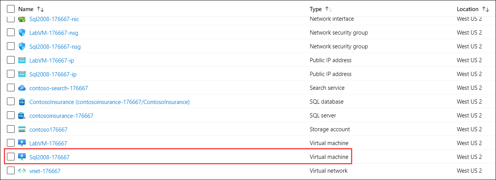

**Step 8.** In the SSMS **Connect to Server** dialog, enter **Sql2008-uniqueid** into the Server name box, ensure **Windows Authentication** is selected, and then select **Connect**.

   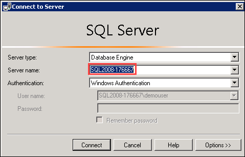

### Task 2: Perform assessment for migration to Azure SQL Database

**Step 6.** On the **Sources** screen, enter the following into the **Connect to a server** dialog that appears on the right-hand side:

   - **Server name**: Enter **Sql2008-uniqueid**.
   - **Authentication type**: Select **SQL Server Authentication**.
   - **Username**: Enter **WorkshopUser**
   - **Password**: Enter **Password.1!!**
   - **Encrypt connection**: Check this box.
   - **Trust server certificate**: Check this box.
   
      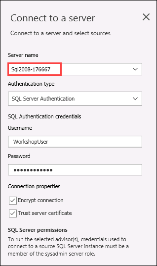
 
 ### Task 3: Migrate the database schema using the Data Migration Assistant
 
 **Step 4.** On the **Select source** tab, enter the following:

   - **Server name**: Enter **Sql2008-uniqueid**.
   - **Authentication type**: Select **SQL Server Authentication**.
   - **Username**: Enter **WorkshopUser**
   - **Password**: Enter **Password.1!!**
   - **Encrypt connection**: Check this box.
   - **Trust server certificate**: Check this box.
   - Select **Connect**, and then ensure the `ContosoInsurance` database is selected from the list of databases.

      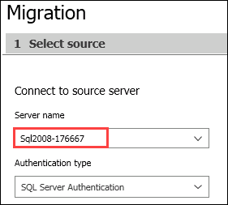

### Task 4: Retrieve connection information for SQL databases

**Step 3 - Note:** If creation fails, you may need to select Advanced settings and specify the subscription, region and resource group for the new storage account as mentioned below:
1. Click on **Show Advanced Settings**.

      
      
2. Use exisiting hands-on-lab-SUFFIX resource group and for:
   - **storage account**: Create new and enter sa-uniqueid, for example: sa176667.
   - **file share**: Create new and enter fs-uniqueid, for example: fs176667.
      
     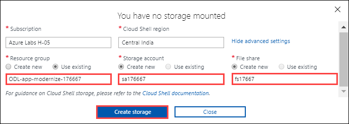
     
 Then select **Create Storage**.
 
**Step 6.** Next, retrieve the public IP address of the SqlServer2008 VM to connect to the database on that server using the following PowerShell command:

    
    az vm list-ip-addresses -g $resourceGroup -n SqlServer2008 --output table
    
    
- Replace SqlServer2008 with name of your SQLVM. It will look similar to the one as following:

    ```
    az vm list-ip-addresses -g $resourceGroup -n Sql2008-176667 --output table
    ```
    
   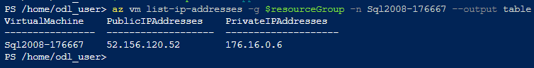 
   
### Task 5: Migrate the database using the Azure Database Migration Service

**Step 5.** On the **Migration Wizard Select source**blade, before saving check **TLS 1.2 security protocol** and then **Save**.
 
   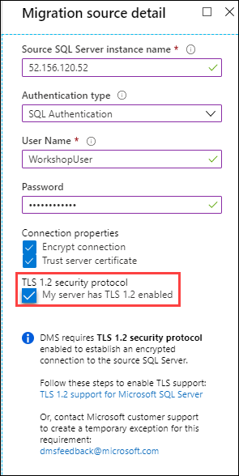

**Step 13.** Validation option: After some updates this option is not more present in the portal. So after providing the **Activity name** click on **Run Migration**.

   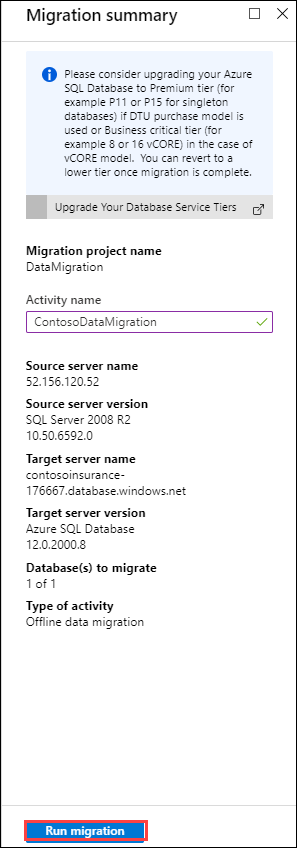

## Exercise 3: Configure Key Vault

### Task 1: Add Key Vault access policy

**Step 3.** In the Add access policy dialog, enter the following:
   - **Select Principal:** Copy the **display name** of your service principal that is given on the lab details page, then paste it in the **Select** block and select when it appears from the list. Then click on **Save**.
 
      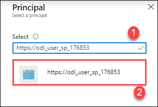

   - It will look similar to the one shown below, then click on **Add** to add the access policy:
   
      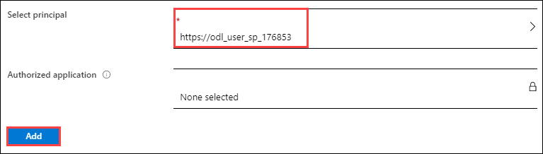

### Task 3: Create a service principal

**Step 6.** Here a pre-created **Service Principal** is provided so you need not to perform this step.

**Step 7.** The details of the pre-created **Service Principal** are provided on lab details page.

  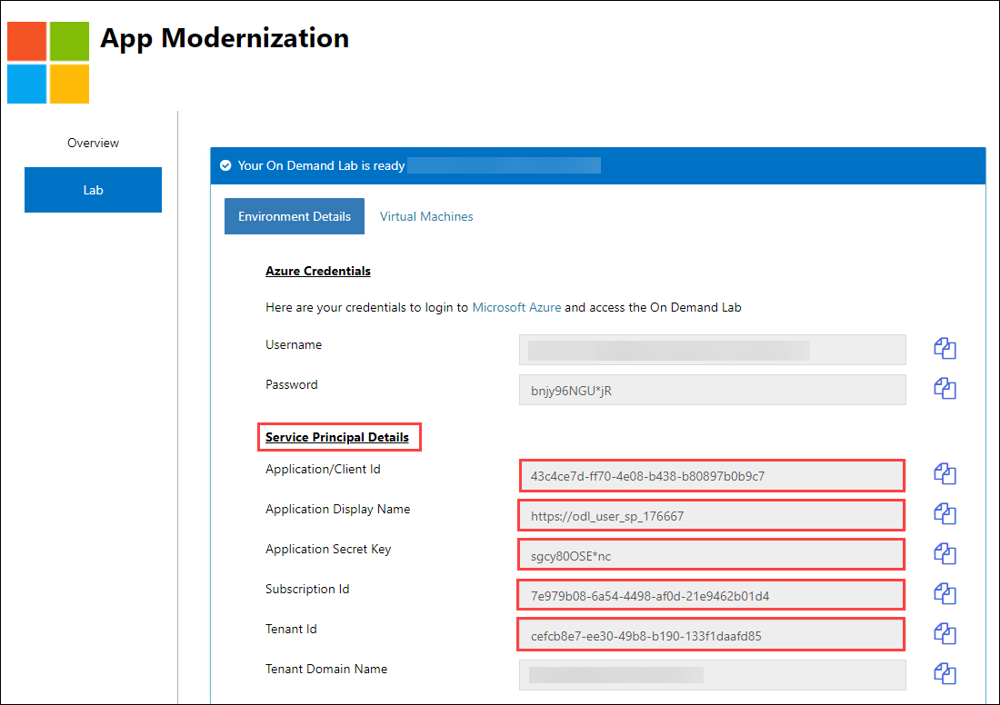

### Task 4: Assign the service principal access to Key Vault

1. Before proceeding to the **Step 1** of this task, enter the following command at the Cloud Shell prompt, by replacing `<your-subscription-id>` with the value you copied above and `<your-resource-group-name>` with the name of your **hands-on-lab-SUFFIX** resource group, and then press **Enter** to run the command:

```
$subscriptionId = "<your-subscription-id>"
$resourceGroup = "<your-resource-group-name>"
```
After this you can start from **Step 1** of this task.

**Step 3.** To assign permissions to your service principal to read Secrets from Key Vault, run the following command, replacing `<your-key-vault-name>` with the name of your Key Vault that you copied in the previous step and pasted into a text editor and replacing **http://contoso-apps** in --spn with the **application id** of the pre-created service principal that you can copy from lab details page.

    az keyvault set-policy -n <your-key-vault-name> --spn http://contoso-apps --secret-permissions get list
    
 After replacing both the values the command will look similar to one shown below:
 
    az keyvault set-policy -n contoso-kv-uniqueid --spn 43c4ce7d-ff70-4e08-b438-b80897b0b9c7 --secret-permissions get list
 
## Exercise 4: Deploy Web API into Azure App Services

### Task 4: Copy KeyVault configuration section to API App in Azure

**Step 4.** You can copy and paste the below mentioned values from the lab details page as shown in previous steps:
 - **your-service-principal-application-id**
 - **your-service-principal-password**
