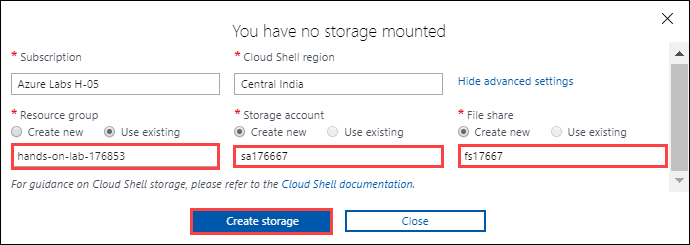

# App Modernization

## Exercise 1: Migrate the on-premises database to Azure SQL Database

### Task 1: Configure the ContosoInsurance database on the SqlServer2008 VM

**Step 1.** In the **Azure portal**, navigate to your **SqlServer2008 VM** by selecting **Resource groups** from Azure services list, selecting the hands-on-lab-SUFFIX resource group, and selecting the **Sql2008-176667 VM** from the list of resources.

   

**Step 8.** In the SSMS **Connect to Server** dialog, enter **Sql2008-176667** into the Server name box, ensure **Windows Authentication** is selected, and then select **Connect**.

   

### Task 2: Perform assessment for migration to Azure SQL Database

**Step 6.** On the **Sources** screen, enter the following into the **Connect to a server** dialog that appears on the right-hand side:

   - **Server name**: Enter **Sql2008-176667**.
   - **Authentication type**: Select **SQL Server Authentication**.
   - **Username**: Enter **WorkshopUser**
   - **Password**: Enter **Password.1!!**
   - **Encrypt connection**: Check this box.
   - **Trust server certificate**: Check this box.
   
      
 
 ### Task 3: Migrate the database schema using the Data Migration Assistant
 
 **Step 4.** On the **Select source** tab, enter the following:

   - **Server name**: Enter **Sql2008-176667**.
   - **Authentication type**: Select **SQL Server Authentication**.
   - **Username**: Enter **WorkshopUser**
   - **Password**: Enter **Password.1!!**
   - **Encrypt connection**: Check this box.
   - **Trust server certificate**: Check this box.
   - Select **Connect**, and then ensure the `ContosoInsurance` database is selected from the list of databases.

      

### Task 4: Retrieve connection information for SQL databases

**Step 3 - Note:** If creation fails, you may need to select Advanced settings and specify the subscription, region and resource group for the new storage account as mentioned below:
1. Click on **Show Advanced Settings**.

      
      
2. Use exisiting hands-on-lab-SUFFIX resource group and for:
   - **storage account**: Create new and enter sa<deploymentid>, for example: sa176667.
   - **file share**: Create new and enter fs<deploymentid>, for example: fs176667.
      
     
     
 Then select **Create Storage**.
 
**Step 6.** Next, retrieve the public IP address of the SqlServer2008 VM to connect to the database on that server using the following PowerShell command:

    ```powershell
    az vm list-ip-addresses -g $resourceGroup -n SqlServer2008 --output table
    ```
- Replace SqlServer2008 with name of your SQLVM. It will look similar to the one as following:

    ```powershell
    az vm list-ip-addresses -g $resourceGroup -n Sql2008-176667 --output table
    ```
    
         
